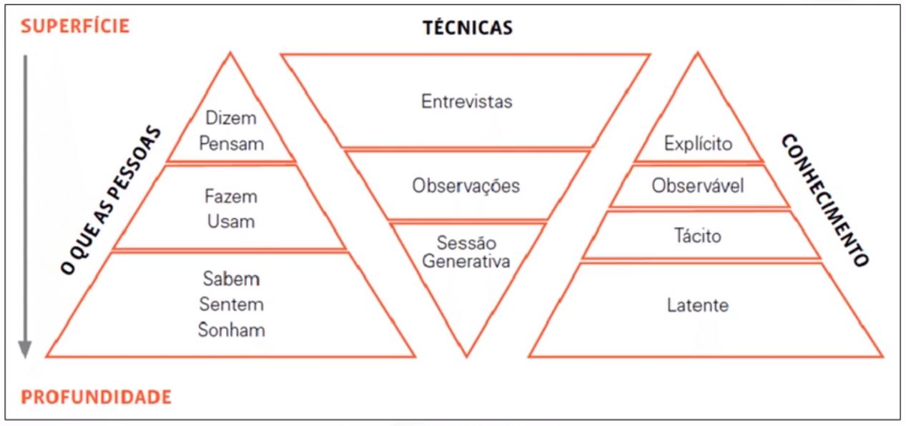

# Design Thinking

Meu resumo do curso de Design Thinking na Treina Web.

## Sumário

- [Inovação](#inovação)
	- [Tipos de Inovação](#tipos-de-inovação)
	- [Impacto da Inovação](#impacto-da-inovação)
	- [Desafios da Inovação](#desafios-da-inovação)
	- [Como Inovar?](#como-inovar)
- [Design Thinking](#design-thinking)
	- [Etapas do Design Thinking](#etapas-do-design-thinking)
		- [Imersão](#imersão)
			- [Preliminar](#preliminar)
			- [Profundidade](#profundidade)
		- [Análise e Síntese](#análise-e-síntese)
		- [Ideação](#ideação)
		- [Prototipação](#prototipação)

## Inovação

Segundo a revista Newsweek, inovação consiste em recriar modelos de negócio e construir mercados inteiramente novos. Tradicionalmente, inovar no meio empresarial significa buscar novas soluções tecnológicas.

A inovação tem a capacidade de agregar valor aos produtos de uma empresa, diferenciando-a, ainda que momentaneamente, no ambiente competitivo.

### Tipos de Inovação

- **Inovação de produto:** modificações nos atributos do produto, com mudança na forma como ele é percebido pelos consumidores;
- **Inovação de processo:** mudança no processo de produção do produto/serviço. Não gera necessariamente impacto no produto final, mas produz benefícios no processo de produção;
- **Inovação de modelo de negócio:** considera mudanças no modelo de negócio. Ou seja, na forma como o produto/serviço é oferecido ao mercado.

### Impacto da Inovação

- **Inovação incremental:** pequenas melhorias contínuas em produtos ou em linhas de produtos;
- **Inovação radical:** mudança drástica na maneira que o produto/serviço é consumido. Geralmente traz um novo paradigma ao segmento de mercado, que modifica o modelo de negócio vigente.

### Desafios da Inovação

- **Soluções de alto nível:** fazer perguntas mais interessantes pode ajudar as equipes a descobrir ideias mais originais;
- **Riscos e custos de mudança menores:** a incerteza é inevitável, por isso os inovadores costumam a criar um portfólio de opções. Para gerenciar essa tensão, os inovadores devem estar dispostos a abandonar as más ideias;
- **Adesão dos funcionários:** inovações só são bem-sucedidas se contam com o apoio dos funcionários da empresa. O caminho mais seguro para conquistar apoio é envolvê-los no processo de geração de ideias.

### Como Inovar?

- Ter consciência da importância de inovar no cenário competitivo vigente;
- Entender o que é inovação e qual é a sua dinâmica;
- Definir uma estratégia que deve estar alinhada aos objetivos da organização e à sua visão de futuro;
- Desenvolver e internalizar ferramentas de gestão do processo de inovação.

## Design Thinking

Design Thinking é uma abordagem focada no ser humano que vê na multidisciplinaridade, colaboração e tangibilização de pensamentos e processos, caminhos que levam a soluções inovadoras para o negócio.

São levados em conta três aspectos:
- O olhar do **SER HUMANO**;
- O olhar de **NEGÓCIO**;
- E o que é possível fazer com **TECNOLOGIA**.

### Etapas do Design Thinking

#### Imersão

Tem por objetivo a aproximação do contexto do projeto tanto do ponto de vista da empresa quanto do usuário final, e é subdividida em duas etapas:

- **Preliminar:** visa o entendimento inicial do problema. Ela deve definir o escopo do projeto e suas fronteiras, além de identificar os perfis de usuários e outros atores-chave que deverão ser abordados.
	- **Reenquadramento:** reuniões de alinhamento estratégico entre a equipe;
		- **Captura:** coleta de dados;
		- **Transformação:** mapeia os dados coletados e adiciona novas perspectivas;
		- **Preparação:** cria materiais de sensibilização de impacto, que estimule o interlocutor a refletir.

	- **Pesquisa exploratória:** auxilia no entendimento do contexto do assunto trabalhado;
	- **Pesquisa desk:** fornece referências das tendências da área estudada no Brasil e exterior.
		- **Primaria:** os dados são coletados diretamente da fonte de informação;
		- **Secundaria:** é realizada com fontes de informações que já foram previamente publicadas por terceiros.

- **Profundidade:** destina-se à identificação das necessidades dos atores envolvidos no projeto e oportunidades. Existem diversas técnicas para a realização de uma pesquisa de profundidade, dentre elas:
	- **Entrevista:** procura em uma conversa com o entrevistado, obter informações através de perguntas, cartões de evocação cultural, dentre outras técnicas;
	- **Registro fotográfico;**
	- **Observação participante;**
	- **Observação indireta;**
	- **Cadernos de sensibilização:** permite que o próprio usuário faça o relato de suas atividades, no contexto de seu dia a dia;
	- **Sessões Generativas:** encontro no qual se convida os usuários ou autores envolvidos no tema do projeto para que dividam suas experiências. Visa entender o que sabem, sentem e sonham.

   

#### Análise e Síntese

Organizar os dados de forma visual para encontrar padrões que auxiliem a compreensão do todo e identificação de oportunidades e desafios.
- **Cartões de insight:** reflexões embasadas em dados reais das pesquisas, transformadas em cartões que facilitam a rápida consulta e o seu manuseio. Geralmente contém um título que resume o achado e o texto original coletado na pesquisa juntamente com a fonte;
- **Diagrama de afinidades:** organização e agrupamento dos cartões de insights com base em afinidade, similaridade, dependência ou proximidade, gerando um diagrama que contém as macro áreas que delimitam o tema trabalhado, suas subdivisões e interdependências;
- **Mapa conseitual:** visualização gráfica, constuída para simplificar e organizar visualmente os dados complexos de campo, em diferentes níveis de profundidade e abstração;
- **Critérios norteadores:** diretrizes balizadoras para o projeto, evidenciando aspectos que não devem ser perdidos de vista ao longo de todas as etapas do desenvolvimento das soluções;
- **Personas:** são arquétipos, personagens fictícios, cencebidos a partir da síntese de comportamentos observados entre consumidores com perfis extremos;
- **Mapa de empatia:** uma ferramenta de síntese das informações sobre o cliente em uma visualização do que ele diz, faz pensa e sente;
	- O que pensa e sente?
	- O que ouve?
	- O que vê?
	- O que fala e faz?
- **Jornada do usuário:** representação gráfica das etapas de relacionamento do cliente com um produto ou serviço, que vai descrevendo os passos-chave percorridos antes, durante e depois da compra/utilização;
- **Blueprint:** matriz que representa visualmente, de forma esquemática e simples, o complexo sistema de interações que caracterizam uma prestação de servioços.

#### Ideação

Criar ideias inovadoras através de atividades colaborativas que estimulem a criatividade. As ideias criadas são selecionadas em função dos objetivos do negócio, da viabilidade tecnológica e necessidades humanas.

#### Prototipação

Faz a tangibilização das ideias, para possibilitar o aprendizado contínuo e validação da solução,
